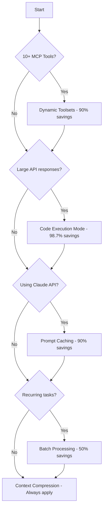

<!-- source: profile:general -->
<!-- EXTRACTED — do not edit directly. Edit source at profiles/general/standards/global/token-optimization-standards.md and re-run profile-sync. -->
<!-- source: profile:default -->
<!-- EXTRACTED — do not edit directly. Edit source at profiles/default/standards/global/token-optimization-standards.md and re-run profile-sync. -->
# Token Optimization Standards

## Overview

This document establishes best practices for reducing AI coding assistant token consumption by 60-99%. Token optimization directly reduces API costs and improves response times by minimizing unnecessary context.

**Related Standards:**
- [Tech Stack Standards](tech-stack.md) - Overall technology standards
- [Progressive Exposure](progressive-exposure.md) - Three-tier model for standards injection into AGENTS.md — controls which standards consume context tokens via priority ordering and budget caps

---

## Quick Impact Ranking

|| Strategy | Input Tokens | Output Tokens | Setup Time | Complexity |
||----------|-------------|---------------|-----------|-----------|
|| Dynamic MCP Toolsets | -90% | - | 4 hours | HIGH |
|| Code Execution Mode | -98.7% | - | 6 hours | HIGH |
|| Prompt Caching | -90% | - | 1 hour | MEDIUM |
|| Batch Processing | - | -50% | 2 hours | MEDIUM |
|| Context Compression | -40-60% | - | 30 min | LOW |
|| Smart Repository Indexing | -50-70% | - | 1 hour | LOW |
|| **Combined Impact** | **-95%** | **-25%** | **14 hours** | - |

---

## Implementation Priority Matrix



---

## 1. MCP Server Optimization

### 1.1 Dynamic Toolsets

**When to Use:** 10+ MCP tools in a server

**Impact:** 90-96% input token reduction

Replace static tool lists with three core discovery tools:

```yaml
Core Tools:
  - search_tools: Natural language search for relevant tools
  - describe_tools: Full schema for requested tools only
  - execute_tool: Execute discovered tool
```

**Tool Metadata Index:**

```json
{
  "tools": [
    {
      "name": "hubspot/list_contacts",
      "category": "crm",
      "source": "hubspot",
      "description": "List contacts in HubSpot with filtering",
      "keywords": ["contact", "email", "customer", "list"],
      "complexity": "low"
    }
  ]
}
```

**Configuration:**

```yaml
# .cursor/mcp-config.yml
dynamic_toolsets:
  enabled: true
  max_tools_per_server: 50
  cache_ttl_hours: 24
```

---

### 1.2 Code Execution Mode

**When to Use:** Large API responses (100+ fields, 1000+ rows)

**Impact:** 98.7% input token reduction

**Pattern: Retrieve, Filter, Summarize**

```typescript
// Expose MCP tools as code APIs
import { crm } from './mcp-api';

// Get all contacts
const allContacts = await crm.listContacts();

// Filter in execution environment
const recentContacts = allContacts
  .filter(c => new Date(c.lastActivity) > Date.now() - 7*24*60*60*1000)
  .slice(0, 10)
  .map(c => ({ id: c.id, email: c.email, stage: c.stage }));

// Only filtered results sent to model
console.log("Recent 10 contacts:", recentContacts);
```

**Configuration:**

```yaml
# .cursor/code-execution.yml
CODE_EXECUTION_TOOLS:
  - typescript: true
  - python: true

EXECUTION_LIMITS:
  - Timeout: 30 seconds
  - Memory: 512MB
  - Data output limit: 10KB
```

---

### 1.3 Lazy Schema Loading with Caching

**Impact:** 85-90% token reduction on repeated tool access

**Configuration:**

```yaml
# .cursor/mcp-cache.yml
cache:
  enabled: true
  ttl_hours: 24
  location: ~/.cursor/tool-schema-cache

schema_discovery:
  - name: crm
    tools: ["hubspot/*"]
    prefetch: true
```

---

## 2. API-Level Optimization

### 2.1 Prompt Caching

**When to Use:** Claude API users (not IDE)

**Impact:** 90% input token savings

**Pricing:**
- Standard input: $3.00 per 1M tokens
- Cached read: $0.30 per 1M tokens (90% discount)
- Cache creation: $3.75 per 1M tokens (one-time)

**Implementation:**

```python
from anthropic import Anthropic

client = Anthropic()

response = client.messages.create(
    model="claude-3-5-sonnet-20241022",
    max_tokens=4096,
    system=[
        {
            "type": "text",
            "text": SYSTEM_CONTEXT,  # System prompt, tool reference, codebase map
            "cache_control": {"type": "ephemeral"}
        }
    ],
    messages=[{"role": "user", "content": "Your request"}]
)

# Monitor cache performance
usage = response.usage
print(f"Cache hit rate: {usage.cache_read_input_tokens / usage.input_tokens:.1%}")
```

**Target:** 80-90% cache hit rate

---

### 2.2 Batch Processing

**When to Use:** 5+ recurring, non-interactive tasks

**Impact:** 50% output token savings

**Ideal for:**
- Daily code reviews
- Bulk refactoring
- Scheduled analysis
- Documentation generation

---

## 3. Context & Content Optimization

### 3.1 Smart Context Compression

**Impact:** 40-60% context reduction

**Techniques:**

1. **Summarize large files** before context inclusion
2. **Field selection** for API responses (return only needed fields)
3. **Hierarchical context loading** (essential, detailed, comprehensive layers)

---

### 3.2 Smart Repository Indexing

**Impact:** 50-70% context reduction

**Create .claudeignore:**

```plaintext
# Dependencies
node_modules/**
.venv/
vendor/

# Build outputs
dist/
build/
.next/

# Development artifacts
.DS_Store
.idea/
.vscode/
*.log
```

**Configuration:**

```yaml
# .cursor/context-config.yml
indexing:
  strategy: "smart"

  priority_high:
    - "src/**/*.ts"
    - "pages/**/*.tsx"
    - "package.json"

  ignore:
    - "node_modules"
    - "dist"

  file_summaries:
    enabled: true
    threshold_lines: 500

  context_budget:
    max_tokens: 10000
```

---

## 4. Workflow Integration

### Decision Tree

```
Do you have 10+ MCP tools?
  YES  Use Dynamic Toolsets (90% reduction, 2-4 hours)
  NO  Continue

Do you return large API responses (100+ fields, 1000+ rows)?
  YES  Use Code Execution Mode (98.7% reduction, 4-8 hours)
  NO  Continue

Are you using Claude API directly (not IDE)?
  YES  Use Prompt Caching (90% savings, 1-2 hours)
  NO  Continue

Do you have recurring, non-interactive tasks?
  YES  Use Batch Processing (50% savings, 2-3 hours)
  NO  Continue

For any tool: Implement Context Compression (40-60% reduction, 30 min)
```

---

## 5. Implementation Roadmap

### Phase 1 (Week 1): Foundation

- Implement `.claudeignore` and `.cursor/context-config.yml`
- Enable prompt caching (if API user)
- Set up monitoring/logging

### Phase 2 (Week 2): MCP Optimization

- Audit current MCP tools
- Build tool metadata index
- Implement semantic search

### Phase 3 (Week 3): Advanced

- Deploy code execution mode
- Configure batch processing
- Fine-tune context compression

### Phase 4 (Ongoing): Monitoring

- Track token usage weekly
- Adjust cache TTL based on patterns
- Refine context budgets

---

## 6. Monitoring & Verification

### Configuration

```yaml
# .cursor/monitoring-config.yml
token_monitoring:
  enabled: true
  daily_budget_alert: 10.0  # dollars
  cache_hit_rate_target: 0.8
  log_detailed_metrics: true
  weekly_report: true
```

### Example Report

```
TOKEN USAGE REPORT - 2026-01-02

Daily Summary:
  Requests: 47
  Input tokens: 142,500
  Output tokens: 38,200
  Cached tokens: 128,700 (90.3% cache hit rate)
  Estimated cost: $2.34

Cost Comparison:
  Without optimization: $23.40
  With optimization: $2.34
  Savings today: $21.06 (90%)
```

---

## 7. Troubleshooting

### Cache Misses High (< 50% hit rate)

- Freeze system prompt (make static)
- Increase cache TTL: 24 → 72 hours
- Pre-populate cache during off-peak hours

### Dynamic Toolsets Slower (4x tool calls)

- Standardize tool naming with consistent prefixes
- Add aliases to tool index
- Expand keyword lists in metadata

### Code Execution Timeouts

- Add pagination to large data operations
- Stream results instead of loading all-at-once
- Increase execution timeout: 30 → 60 seconds

---

## 8. Cost Estimation

### Token Cost Optimization Impact

- Token reduction: 90-95%
- Cost reduction: 85-90% reduction in API spend
- Example: $200/month → $20-30/month

### ROI Calculation

```
Before: $200/month (typical heavy usage)
After optimization: $20-30/month
Savings: $170-180/month
Setup cost: ~14 hours @ $100/hr = $1,400
Break-even: ~8 months
```

---

## 9. Final Checklist

Before deploying to production:

- [ ] Token monitoring is active
- [ ] Cache TTL configured based on update frequency
- [ ] `.claudeignore` file created
- [ ] Dynamic toolsets implemented (if 10+ tools)
- [ ] Code execution mode tested (if large datasets)
- [ ] Batch processing configured (if recurring tasks)
- [ ] Context compression applied to large files
- [ ] Team trained on optimization patterns
- [ ] Weekly review process established
- [ ] Budget alerts configured

---

## 10. Quick Reference Commands

```bash
# Token Monitoring
claude monitor tokens --daily
claude monitor cache --rate

# MCP Server Optimization
wrangler secret put CACHE_TTL --value "86400"  # 24 hours
wrangler monitor --tokens

# Context Configuration
cat .claudeignore  # Review exclusions
claude context compress --input large-file.json --output summary.txt

# Cache Management
claude cache clear --expired
claude cache warmup --tools hubspot notion
```

---

## References

- [Tech Stack Standards](tech-stack.md) - Technology decisions
- [Cloudflare Workers Documentation](https://developers.cloudflare.com/workers/) - Workers deployment
- [MCP Protocol](https://modelcontextprotocol.io/) - Protocol reference

---

**Expected timeline to full optimization:** 2-4 weeks

**Expected token reduction:** 90-95% for optimized workflows

**Expected cost savings:** 85-90% reduction in API spend

---

## Always-Loaded Memory Budget

*Calibrated from footprint audit on dev-os 2026-06-25. Source: `product/specs/2026-06-24-agent-memory-file-discipline/planning/baseline-measurement.md`.*

### Budget Thresholds

| Scope | Target | WARN threshold | Over-budget flag |
|---|---|---|---|
| Global surface (behavior-shaping blocks) | ≤ 2,500t | ≥ 3,000t | ≥ 4,000t |
| Per-project managed-block always-loaded surface | ≤ 5,000t | ≥ 6,000t | ≥ 10,000t |

**These are advisory WARN thresholds — not hard blockers.** Sessions are not gated. The `context-surface-audit --footprint` mode emits PASS/warn/over-budget signals for visibility.

### Dev-OS Baseline (pre-move)

- CLAUDE.md: 5,904t (pass) — DEVOS_CHAINS_INDEX 3,507t dominated
- AGENTS.md: 14,477t (over-budget) — DEVOS_STANDARDS 6,753t + DEVOS_CHAINS_INDEX 3,507t

### Dev-OS After-Move (DEVOS_CHAINS_INDEX → devos-chains pointer)

- CLAUDE.md: ~2,397t (pass) — saved 3,507t (-59%)
- AGENTS.md: ~10,970t (warn) — saved 3,507t (-24%); DEVOS_STANDARDS is next candidate

### Memory→Skill Routing Rule

Large indexes (≥ 1,000t per file) that have an existing on-demand skill surface belong **behind that skill**, not in the always-loaded surface. Always-loaded memory keeps a one-line pointer so the agent knows the on-demand surface exists.

**Decision tree:**
1. Does the agent need this index on every request, regardless of task? → always-loaded is justified.
2. Is there an existing on-demand skill that exposes it? → move behind the skill, leave a one-line pointer.
3. Does the index exceed 1,000t per context file? → routing candidate; audit flags it.

**Current routing targets (per D4):**
| Block | Tokens | On-demand skill | Status |
|---|---|---|---|
| DEVOS_CHAINS_INDEX | 3,507t/file | `devos-chains` | → moved 2026-06-25 |
| DEVOS_STANDARDS | 6,753t in AGENTS.md | `standards-guide` | next candidate |
| DEVOS_SKILLS_INDEX | 1,820t in AGENTS.md | `find-skills` | candidate |

### Enforcement

The `context-surface-audit --footprint` mode emits a routing recommendation for every block ≥ 1,000t that has a known on-demand skill. The audit is the enforcement mechanism — no new blocking hook.

Configure thresholds via env: `DEVOS_FOOTPRINT_WARN_THRESHOLD` / `DEVOS_FOOTPRINT_OVER_THRESHOLD`.  
Compute with: `bash scripts/lib/context-footprint.sh <file> contracts/managed-blocks.yml`
